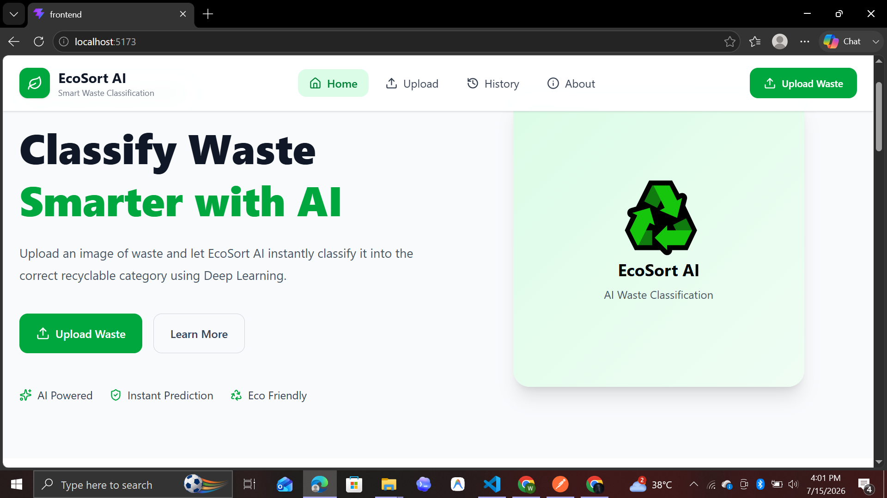
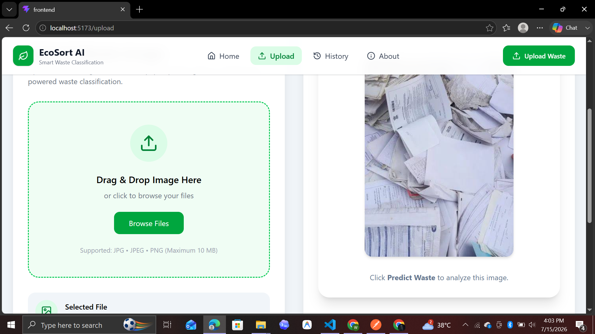
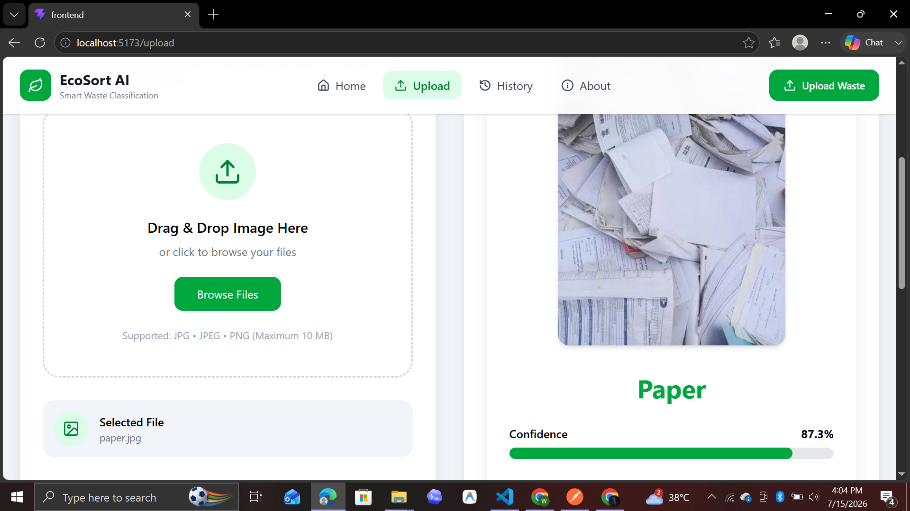
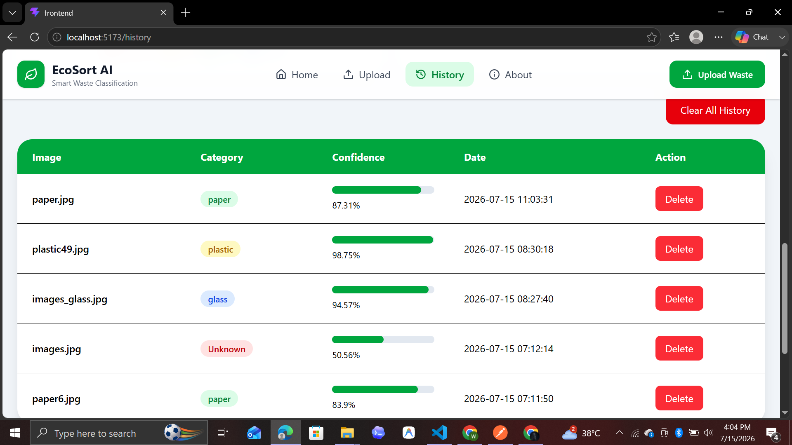
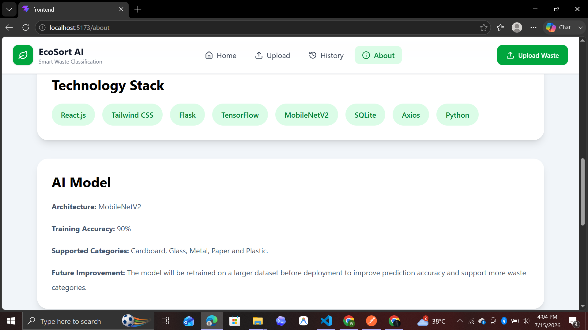

# ♻️ EcoSortAI

> AI-powered Waste Classification Web Application built with **React**, **Flask**, **TensorFlow**, and **SQLite**.


---

## 🌍 Overview

EcoSortAI is an AI-powered web application that helps users classify recyclable waste using Deep Learning.

Users can upload an image of waste, and the system predicts its category with a confidence score. The application also stores prediction history, provides waste information, and displays analytics through an interactive dashboard.

---

# 📸 Application Preview

## 🏠 Home Page



---

## 📤 Upload Waste



---

## 🤖 Prediction Result



---

## 📊 History Dashboard



---

## ℹ️ About Page



---

# ✨ Features

- 🤖 AI-powered waste classification
- 📤 Upload waste images
- 📈 Confidence score
- ♻️ Recycling information
- 🌱 Eco tips
- 📜 Prediction history
- 📊 Analytics dashboard
- 🥧 Pie chart visualization
- 🔍 Search history
- 🗑 Delete individual predictions
- 🧹 Clear complete history
- 📱 Fully responsive UI

---

# 🗂 Supported Waste Categories

| Category     | Supported |
| ------------ | --------- |
| 📦 Cardboard | ✅        |
| 📄 Paper     | ✅        |
| 🥤 Plastic   | ✅        |
| 🍾 Glass     | ✅        |
| 🥫 Metal     | ✅        |

---

# 🛠 Technology Stack

## Frontend

- React.js
- Tailwind CSS
- React Router
- Axios
- Recharts
- Lucide React

---

## Backend

- Flask
- Flask-CORS
- SQLite

---

## Artificial Intelligence

- TensorFlow
- MobileNetV2
- NumPy
- Pillow

---

# 📂 Project Structure

```text
EcoSortAI
│
├── backend
│   ├── database
│   ├── models
│   ├── routes
│   ├── services
│   ├── uploads
│   ├── utils
│   ├── app.py
│   └── config.py
│
├── frontend
│   ├── src
│   ├── public
│   └── package.json
│
├── screenshots
│   ├── home.png
│   ├── upload.png
│   ├── prediction.png
│   ├── history.png
│   └── about.png
│
└── README.md
```

---

# 🚀 Installation

## Clone Repository

```bash
git clone https://github.com/Warishaaaaaaa/EcoSortAI.git
```

---

## Frontend

```bash
cd frontend

npm install

npm run dev
```

---

## Backend

Create Virtual Environment

```bash
python -m venv venv
```

Activate

### Windows

```bash
venv\Scripts\activate
```

### Linux / macOS

```bash
source venv/bin/activate
```

Install dependencies

```bash
pip install -r requirements.txt
```

Run Flask

```bash
python app.py
```

---

# 🧠 AI Model

| Property          | Value         |
| ----------------- | ------------- |
| Architecture      | MobileNetV2   |
| Framework         | TensorFlow    |
| Training Accuracy | **90%**       |
| Image Size        | **224 × 224** |
| Classes           | 5             |

### Supported Classes

- Cardboard
- Glass
- Metal
- Paper
- Plastic

---

# 📈 Future Improvements

- ♻️ Support more waste categories
- 📦 Batch image prediction
- 👤 User authentication
- ☁️ Cloud database
- 📱 Mobile application
- 🚀 Production deployment

---

# 👩‍💻 Developer

**Warisha Amjad**

---

# 🙏 Acknowledgements

- TensorFlow
- React
- Flask
- Tailwind CSS
- MobileNetV2
- Recharts

---

# 📄 License

This project is developed for educational purposes.

---

## ⭐ Support

If you found this project useful, consider giving it a **⭐ Star** on GitHub.
